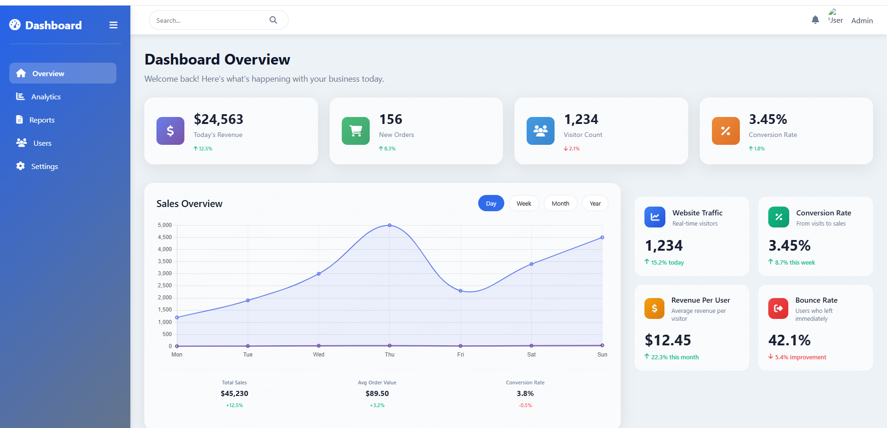
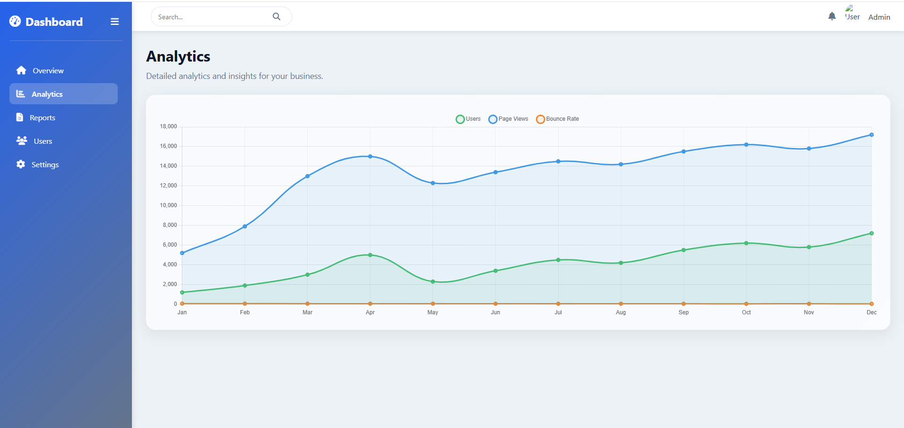

# 📊 Business Intelligence Dashboard API



A backend system for a **Business Intelligence Dashboard** built with **PHP, MySQL, and RESTful APIs** to manage analytics, products, orders, and customer data.

---

## 🚀 Features

* User authentication system
* Product and inventory management
* Order tracking system
* Sales analytics and reports
* Customer analytics and reviews
* Marketing campaign tracking
* Website traffic analytics
* Geographic sales analysis
* Activity logging system

---

## 🛠 Tech Stack

<p>

</p>

---

## 🗄 Database Structure

The database contains **11 main tables**:

* users
* customers
* products
* orders
* order_items
* sales_analytics
* website_analytics
* marketing_campaigns
* customer_reviews
* geographic_sales
* activity_log

---

## 🔌 API Endpoints

### Authentication

```
POST /api/auth/login
POST /api/auth/logout
POST /api/auth/register
GET  /api/auth/status
```

### Dashboard Data

```
GET /api/dashboard/overview
GET /api/dashboard/sales-chart
GET /api/dashboard/performance
GET /api/dashboard/products
GET /api/dashboard/orders
GET /api/dashboard/financial
GET /api/dashboard/inventory
```

---

## ⚙️ Installation

1️⃣ Clone the repository

```bash
git clone https://github.com/YOUR_USERNAME/dashboard-system.git
```

2️⃣ Create database

```sql
CREATE DATABASE dashboard_db;
```

3️⃣ Import database

```bash
mysql -u username -p dashboard_db < database.sql
```

4️⃣ Configure database connection

Edit:

```
config/database.php
```

---

## 📸 Screenshots

Add dashboard screenshots here.




## 👨‍💻 Author

Mohamed Ramadan  
Backend Developer (Laravel)

## 📫 Connect With Me

<p align="left">

<a href="https://github.com/mohamedramadan217">

</a>

<a href="https://www.linkedin.com/in/mohamed-ramadan-b811133a1">

</a>

<a href="mailto:mo7amedramad2n@email.com">

</a>

</p>
